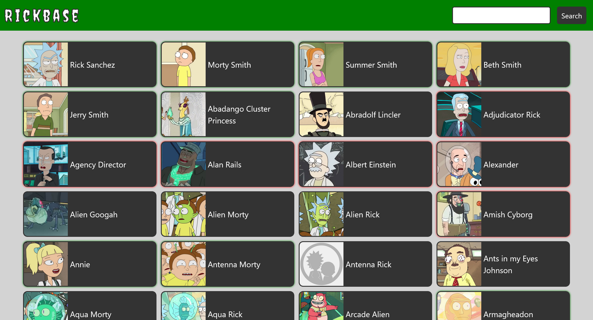

# Rickbase

This app shows a list of all characters from the Rick and Morty series loaded from an external API.
If you click on a character a modal with the character details will open.
You can also search for a character by its name.
This app was developed to learn TypeScript and SCSS and practice jQuery.

## Used technologies

- HTML
- SCSS
- TypeScript
- jQuery
- Ajax

## Link to the live version

The online hosted version of this app can be found here: [Rickbase](https://schlumen.github.io/rickbase/).